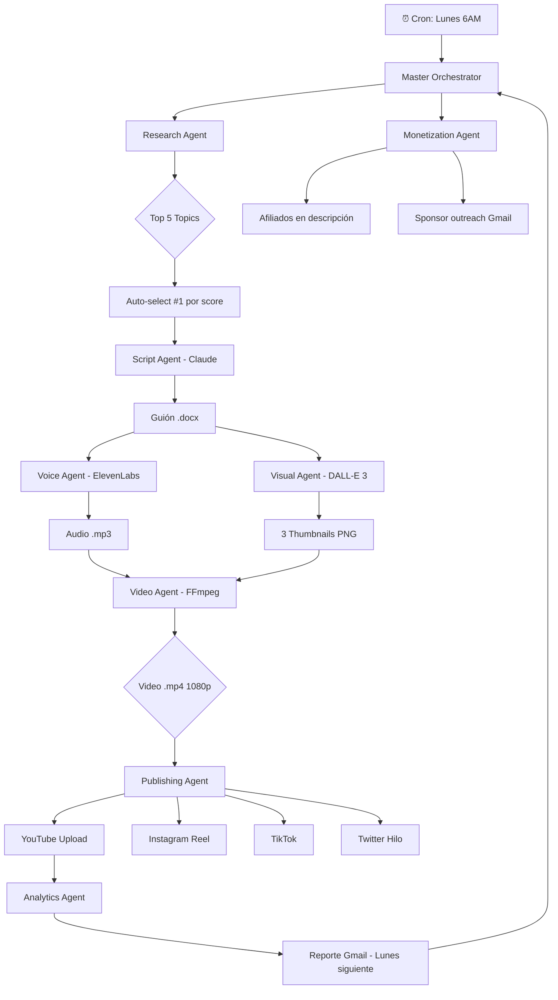

# BLUEPRINT ESTRATÉGICO
## Pipeline Autónomo de Monetización YouTube + Multiplataforma
### Canal: Automatización con IA para Negocios LATAM

**Versión:** 1.0  
**Fecha:** 2026-03-31  
**Autor:** Sistema Multi-Agente (Claude Opus)  
**Clasificación:** Documento estratégico interno

---

## RESUMEN EJECUTIVO

Este documento define la arquitectura completa de un pipeline 100% automatizado para crear, publicar y monetizar contenido en YouTube y redes sociales secundarias (Instagram, TikTok, X/Twitter, Facebook), operado en su totalidad por agentes de IA orquestados por Claude. El canal se posiciona en el nicho **"Automatización con IA para negocios LATAM en español"** — mercado de bajísima competencia, alto CPM ($8–20 USD) y sinergia directa con el negocio de consultoría existente del creador, convirtiendo cada video en un activo dual: ingreso pasivo por AdSense y generador de leads calificados para proyectos freelance. El MVP (primer video publicado end-to-end automáticamente) se entrega en **14 días**. La monetización de AdSense se proyecta activar entre el mes 3 y 4. Los ingresos combinados (AdSense + sponsorships + afiliados + leads generados) se proyectan entre $2.000 y $8.000 USD mensuales al mes 12, con un piso de reinversión de $0 gracias al stack de herramientas gratuitas/freemium priorizadas en el MVP.

---

## PARTE 1 — USER STORY MAPPING (JTBD Framework)

### Las 10 historias de usuario críticas

---

**US-YT-001 — Descubrimiento de tendencias**

**Como** creador de contenido en IA trabajando en solitario desde el celular,  
**Quiero** que un agente identifique automáticamente los 5 temas más virales de la semana en mi nicho,  
**Para que** nunca publique contenido sin demanda y maximice las posibilidades de que el algoritmo lo distribuya,  
**Pain Point:** Hoy toma 2–3 horas semanales revisar YouTube Trends, Google Trends, Reddit, LinkedIn y TikTok manualmente — y aún así se elige mal el tema por sesgo de confirmación,  
**Criterios de aceptación:**
- El agente entrega un ranking de 5 temas con volumen de búsqueda estimado, competencia (videos similares publicados en los últimos 7 días) y potencial de CTR
- El output llega a la bandeja de Gmail cada lunes a las 8am
- El proceso tarda menos de 10 minutos sin intervención humana

---

**US-YT-002 — Escritura de guiones virales**

**Como** creador que no tiene tiempo de escribir guiones,  
**Quiero** que un agente genere un guión completo de 8–12 minutos en formato hook-cuerpo-CTA optimizado para retención,  
**Para que** el video tenga estructura probada que maximice watch time y el algoritmo lo priorice,  
**Pain Point:** Escribir un guión toma 3–5 horas y el resultado suele ser demasiado técnico o aburrido para el público general,  
**Criterios de aceptación:**
- Guión incluye hook de los primeros 30 segundos (patrón: pregunta + promesa + dato impactante)
- Estructura en secciones de máximo 90 segundos para mantener ritmo
- CTA múltiple: al minuto 4 (suave), al minuto 8 (suscripción) y al final (link en descripción)
- Tono conversacional, en español latinoamericano neutro
- Exportado automáticamente como .docx a la carpeta del proyecto

---

**US-YT-003 — Generación de thumbnails que convierten**

**Como** creador que sabe que el thumbnail es el 50% del CTR,  
**Quiero** que un agente genere 3 variantes de thumbnail para A/B testing con texto, emoción y composición optimizados,  
**Para que** el CTR supere el 6% y el algoritmo interprete que el video es relevante,  
**Pain Point:** Diseñar thumbnails en Canva toma 1 hora por video y el resultado es inconsistente,  
**Criterios de aceptación:**
- 3 variantes generadas automáticamente (con distintas emociones: sorpresa, urgencia, curiosidad)
- Texto en thumbnail de máximo 5 palabras, contraste legible en mobile
- Dimensiones correctas: 1280x720px, formato JPG <2MB
- Generadas con DALL-E 3 o Stable Diffusion vía API

---

**US-YT-004 — Síntesis de voz realista**

**Como** creador que no quiere aparecer en cámara o grabar audio,  
**Quiero** que un agente sintetice el guión en audio con voz en español latinoamericano natural y expresiva,  
**Para que** el video tenga narración profesional sin costos de estudio ni exposición personal,  
**Pain Point:** El TTS nativo de herramientas gratuitas suena robótico y destruye la retención,  
**Criterios de aceptación:**
- Voz con prosodia natural (pausas, énfasis, variación de tono)
- Velocidad ajustada para contenido educativo (130–150 palabras por minuto)
- Audio exportado como .mp3 / .wav sin artefactos
- ElevenLabs o Azure Neural TTS como proveedor

---

**US-YT-005 — Ensamblaje de video automático**

**Como** creador sin conocimientos de edición de video,  
**Quiero** que un agente tome el audio generado, imágenes de stock relevantes, subtítulos y motion graphics y ensamble el video final listo para subir,  
**Para que** no tenga que tocar Premiere, DaVinci ni ningún editor manual,  
**Pain Point:** La edición de video es el cuello de botella más grande: 4–8 horas por video incluso con plantillas,  
**Criterios de aceptación:**
- Video exportado en .mp4, 1080p, bitrate adecuado para YouTube
- Subtítulos quemados (burn-in) o como .srt separado
- Transiciones automáticas entre secciones del guión
- B-roll de stock relevante insertado automáticamente cada 30–60 segundos
- Duración final entre 8 y 15 minutos

---

**US-YT-006 — Publicación y scheduling multiplataforma**

**Como** creador que quiere presencia en 5 plataformas sin trabajo manual,  
**Quiero** que un agente publique el video en YouTube y adapte el contenido (formato, duración, copy) para Instagram Reels, TikTok, X y Facebook automáticamente,  
**Para que** cada pieza de contenido genere tráfico desde múltiples fuentes sin esfuerzo adicional,  
**Pain Point:** Adaptar un video de YouTube a 4 plataformas más toma 2–3 horas adicionales de trabajo manual,  
**Criterios de aceptación:**
- YouTube: video completo + título + descripción SEO + tags + thumbnail + capítulos
- Instagram/TikTok: clip de 60–90 segundos del hook + caption + hashtags
- X/Twitter: hilo de 5 tweets con insights del video + link
- Facebook: post largo con resumen + video embebido
- Todo programado en el horario óptimo por plataforma (Google Calendar MCP)

---

**US-YT-007 — Monitoreo de analytics y loop de mejora**

**Como** creador que quiere mejorar continuamente sin revisar dashboards,  
**Quiero** que un agente monitoree las métricas clave de cada video y me envíe un reporte de performance con recomendaciones de mejora,  
**Para que** cada video siguiente sea mejor que el anterior basado en datos reales,  
**Pain Point:** YouTube Analytics es denso y consumir esos datos requiere conocimiento técnico que la mayoría de creadores no tiene,  
**Criterios de aceptación:**
- Reporte semanal por Gmail con: CTR, AVD (Average View Duration), impresiones, suscriptores ganados/perdidos
- Alerta automática si un video supera 1.000 views en 48hs (señal de viral)
- Recomendación accionable: qué cambiar en el próximo video basado en los datos
- Comparación semana a semana con tendencia

---

**US-YT-008 — Monetización y outreach de sponsorships**

**Como** creador que quiere ingresos más allá de AdSense desde el mes 3,  
**Quiero** que un agente identifique marcas relevantes para mi nicho y les envíe un pitch personalizado con mis métricas actualizadas,  
**Para que** tenga ingresos por sponsorships sin perder tiempo en ventas manuales,  
**Pain Point:** El outreach de sponsorships es tedioso: investigar la marca, personalizar el email, hacer seguimiento, trackear respuestas — fácilmente 10 horas por deal,  
**Criterios de aceptación:**
- Lista de 20 marcas potenciales generada automáticamente (relevancia al nicho + presupuesto de marketing estimado)
- Email personalizado generado con las métricas actuales del canal
- Enviado desde Gmail MCP con seguimiento automático a los 7 días si no hay respuesta
- Pipeline de deals trackeado en Google Sheets

---

**US-YT-009 — Integración de afiliados en el contenido**

**Como** creador que quiere ingresos desde el primer video publicado,  
**Quiero** que el agente de scripts integre automáticamente links de afiliados relevantes en la descripción y menciones naturales en el guión,  
**Para que** cada video genere ingresos por comisiones sin parecer publicidad forzada,  
**Pain Point:** Recordar integrar afiliados manualmente en cada video es inconsistente y muchas veces se olvida,  
**Criterios de aceptación:**
- Base de datos de programas de afiliados relevantes al nicho (n8n, Make, ElevenLabs, Notion, etc.)
- El agente selecciona el afiliado más relevante para el tema del video
- Mención natural integrada en el guión (no suena a publicidad)
- Link en descripción con UTM tracking para medir conversiones
- Ingresos por afiliados trackeados mensualmente

---

**US-YT-010 — Canal autónomo mientras el creador trabaja en otra cosa**

**Como** freelancer cuyo negocio principal es la consultoría,  
**Quiero** que todo el pipeline de YouTube funcione completamente sin mi intervención después del setup inicial,  
**Para que** el canal crezca y genere ingresos mientras yo atiendo clientes y proyectos,  
**Pain Point:** La mayoría de "automatizaciones de YouTube" todavía requieren 2–4 horas semanales de supervisión y aprobación manual,  
**Criterios de aceptación:**
- El pipeline completo corre en modo autónomo (trigger semanal automático)
- Intervención humana opcional (aprobar/rechazar tema antes de producción) pero no obligatoria
- Notificación por WhatsApp/Gmail cuando hay algo que revisar
- Si no hay respuesta en 2 horas, el sistema procede con el tema más votado por el algoritmo de tendencias

---

## PARTE 2 — EPIC MAP Y SPRINT PLANNING (SCRUM)

### Épicas del proyecto

| ID | Épica | Descripción | Story Points Totales |
|---|---|---|---|
| EP-01 | Foundation & Setup | Canal, cuentas, APIs, estructura de carpetas | 21 SP |
| EP-02 | Research Engine | Agente de tendencias y selección de temas | 13 SP |
| EP-03 | Content Factory | Guiones, thumbnails, voz | 21 SP |
| EP-04 | Video Production | Ensamblaje automático de video | 34 SP |
| EP-05 | Distribution Pipeline | Publicación multiplataforma | 21 SP |
| EP-06 | Analytics Loop | Monitoreo y feedback automático | 13 SP |
| EP-07 | Monetization Engine | AdSense, sponsorships, afiliados | 21 SP |

**Total estimado:** 144 Story Points — 7 sprints de 2 semanas

---

### SPRINT 0 — Foundation (Días 1–7)
**Objetivo:** Todo el andamiaje listo antes de escribir una sola línea de agente.

| ID | Tarea | SP | Prioridad |
|---|---|---|---|
| S0-01 | Crear canal de YouTube (nicho, nombre, branding) | 2 | 🔴 |
| S0-02 | Configurar YouTube Data API v3 + OAuth | 3 | 🔴 |
| S0-03 | Crear cuenta ElevenLabs (plan gratuito → $5/mes) | 1 | 🔴 |
| S0-04 | Configurar OpenAI API key (DALL-E 3 para thumbnails) | 1 | 🔴 |
| S0-05 | Setup n8n self-hosted o n8n.cloud (ya conoce el stack) | 3 | 🔴 |
| S0-06 | Crear estructura de carpetas del proyecto YouTube | 1 | 🔴 |
| S0-07 | Definir 20 temas piloto del nicho (backlog de contenido) | 3 | 🟠 |
| S0-08 | Registrarse en programas de afiliados: n8n, Make, ElevenLabs, Notion, Canva | 2 | 🟠 |
| S0-09 | Crear cuenta en plataformas sociales con handle consistente | 2 | 🟡 |
| S0-10 | Configurar Google Sheets como base de datos del canal | 2 | 🟡 |

**Definition of Done Sprint 0:** Canal creado, todas las APIs configuradas, n8n corriendo, primer workflow de prueba ejecutado.

---

### SPRINT 1 — MVP Research + Script (Días 8–21)
**Objetivo:** Primer guión generado automáticamente desde una tendencia real.

| ID | Tarea | SP | Prioridad |
|---|---|---|---|
| S1-01 | Agente de tendencias: web_search Google Trends + YouTube | 5 | 🔴 |
| S1-02 | Prompt engineering para scoring de topics (demanda vs competencia) | 3 | 🔴 |
| S1-03 | Agente de guión: estructura hook-cuerpo-CTA | 5 | 🔴 |
| S1-04 | Export automático a .docx (skill ya disponible) | 2 | 🔴 |
| S1-05 | Agente de thumbnail: prompt DALL-E 3 + texto overlay | 5 | 🟠 |
| S1-06 | Pipeline n8n: Trends → Script → Thumbnail en secuencia | 5 | 🟠 |
| S1-07 | Notificación Gmail cuando el contenido está listo para revisión | 2 | 🟠 |

**Definition of Done Sprint 1:** Dado un trigger manual en n8n, el sistema entrega en menos de 15 minutos: ranking de topics, guión completo en .docx y 3 thumbnails candidatos en la carpeta del proyecto.

---

### SPRINT 2 — Voice + Video Assembly MVP (Días 22–35)
**Objetivo:** Primer video completo generado sin intervención humana.

| ID | Tarea | SP | Prioridad |
|---|---|---|---|
| S2-01 | Integración ElevenLabs API → audio desde guión | 5 | 🔴 |
| S2-02 | Setup Remotion o FFmpeg para ensamblaje de video | 8 | 🔴 |
| S2-03 | Búsqueda y descarga automática de B-roll (Pexels/Pixabay API) | 5 | 🔴 |
| S2-04 | Generación automática de subtítulos (.srt) desde audio | 3 | 🟠 |
| S2-05 | Motion graphics básicos: intro, lower thirds, outro | 5 | 🟠 |
| S2-06 | Pipeline completo: Guión → Audio → Video → .mp4 | 5 | 🔴 |
| S2-07 | QA automático: duración, resolución, bitrate | 2 | 🟠 |

**Definition of Done Sprint 2:** El sistema genera un .mp4 de 8–12 minutos en 1080p listo para subir, partiendo solo del guión aprobado.

---

### SPRINT 3 — Publishing Pipeline (Días 36–49)
**Objetivo:** Video publicado en YouTube y adaptado a 4 plataformas automáticamente.

| ID | Tarea | SP | Prioridad |
|---|---|---|---|
| S3-01 | Integración YouTube Data API v3 para upload automático | 8 | 🔴 |
| S3-02 | Agente de metadata: título SEO, descripción, tags, capítulos | 5 | 🔴 |
| S3-03 | Scheduling óptimo (Google Calendar MCP) | 3 | 🟠 |
| S3-04 | Corte automático de Short/Reel (60–90 seg del hook) | 5 | 🟠 |
| S3-05 | Publicación Instagram via Graph API | 5 | 🟠 |
| S3-06 | Publicación TikTok via TikTok API | 5 | 🟠 |
| S3-07 | Hilo de X/Twitter generado automáticamente | 3 | 🟡 |
| S3-08 | Post de Facebook generado automáticamente | 3 | 🟡 |

**Definition of Done Sprint 3:** Un trigger en n8n publica el video en YouTube en el horario óptimo y distribuye clips adaptados en las 4 plataformas secundarias sin intervención humana.

---

### SPRINT 4 — Analytics Loop (Días 50–63)
**Objetivo:** Sistema aprende de cada video y mejora el siguiente.

| ID | Tarea | SP | Prioridad |
|---|---|---|---|
| S4-01 | Conexión YouTube Analytics API (CTR, AVD, impresiones) | 5 | 🔴 |
| S4-02 | Reporte semanal automático por Gmail | 3 | 🔴 |
| S4-03 | Alerta de video viral (>1000 views en 48hs) | 2 | 🟠 |
| S4-04 | Agente de insights: qué funcionó → ajustar próximo guión | 5 | 🟠 |
| S4-05 | Dashboard en Google Sheets (actualización automática) | 3 | 🟡 |

**Definition of Done Sprint 4:** El sistema envía cada lunes un email con el performance de la semana y ajusta automáticamente los parámetros del próximo video (duración, estructura, tono).

---

### SPRINT 5 — Monetización (Días 64–90)
**Objetivo:** Primeros ingresos más allá de AdSense activados.

| ID | Tarea | SP | Prioridad |
|---|---|---|---|
| S5-01 | Agente de integración de afiliados en guiones | 5 | 🔴 |
| S5-02 | Base de datos de afiliados por relevancia temática | 3 | 🔴 |
| S5-03 | UTM tracking en links de descripción | 2 | 🟠 |
| S5-04 | Agente de prospecting de sponsorships (web_search) | 5 | 🟠 |
| S5-05 | Pipeline de outreach Gmail MCP con seguimiento | 5 | 🟠 |
| S5-06 | Tracker de ingresos en Google Sheets | 3 | 🟡 |

**Definition of Done Sprint 5:** El canal tiene afiliados integrados en cada video, el agente envía 10 pitches de sponsorship por semana y trackea las respuestas en Sheets.

---

## PARTE 3 — ARQUITECTURA DEL SISTEMA

### Mapa de Agentes

```
┌─────────────────────────────────────────────────────────────────────┐
│                    MASTER ORCHESTRATOR AGENT                         │
│                         (Claude Opus)                                │
│              Trigger: Lunes 6:00 AM (cron n8n)                      │
└──────────┬──────────┬──────────┬──────────┬──────────┬─────────────┘
           │          │          │          │          │
           ▼          ▼          ▼          ▼          ▼
    ┌──────────┐ ┌──────────┐ ┌──────────┐ ┌──────────┐ ┌──────────┐
    │ RESEARCH │ │  SCRIPT  │ │  VISUAL  │ │  VIDEO   │ │PUBLISHING│
    │  AGENT   │ │  AGENT   │ │  AGENT   │ │  AGENT   │ │  AGENT   │
    │          │ │          │ │          │ │          │ │          │
    │web_search│ │  Claude  │ │ DALL-E 3 │ │  FFmpeg  │ │ YT API   │
    │ YT Trends│ │  Sonnet  │ │ Stability│ │ Remotion │ │IG API    │
    │ Google   │ │  (guión) │ │ Canva API│ │ ElevenLab│ │TikTok API│
    │ Trends   │ │  .docx   │ │ Pexels   │ │ Pexels   │ │Twitter   │
    └──────┬───┘ └────┬─────┘ └────┬─────┘ └────┬─────┘ └────┬─────┘
           │          │            │             │             │
           └──────────┴────────────┴─────────────┴────────────┘
                                   │
                                   ▼
                          ┌─────────────────┐
                          │ ANALYTICS AGENT  │
                          │                  │
                          │  YT Analytics API│
                          │  Gmail MCP       │
                          │  Google Sheets   │
                          └────────┬─────────┘
                                   │
                                   ▼
                          ┌─────────────────┐
                          │MONETIZATION AGENT│
                          │                  │
                          │  Afiliados DB    │
                          │  Gmail MCP       │
                          │  Sponsor outreach│
                          └─────────────────┘
```

### Diagrama de flujo de datos (Mermaid)



### Stack tecnológico completo

| Componente | Herramienta | Costo | Estado |
|---|---|---|---|
| Orquestador | n8n (self-hosted) | $0 | ✅ Ya instalado |
| LLM principal | Claude Sonnet via API | ~$5–15/mes | ✅ Disponible |
| Research | web_search nativo | $0 | ✅ Disponible |
| Guiones | Claude Sonnet | Incluido arriba | ✅ Disponible |
| Voz | ElevenLabs Starter | $5/mes | ❌ Falta setup |
| Imágenes/Thumbnails | DALL-E 3 via API | ~$3–8/mes | ❌ Falta setup |
| Video assembly | FFmpeg (local) | $0 | ❌ Falta instalar |
| B-roll stock | Pexels API | $0 | ❌ Falta setup |
| Subtítulos | Whisper API (OpenAI) | ~$2/mes | ❌ Falta setup |
| YouTube Upload | YouTube Data API v3 | $0 | ❌ Falta setup |
| Instagram | Graph API | $0 | ❌ Falta setup |
| TikTok | TikTok API | $0 | ❌ Falta setup |
| Scheduling | Google Calendar MCP | $0 | ✅ Disponible |
| Email outreach | Gmail MCP | $0 | ✅ Disponible |
| Analytics | YouTube Analytics API | $0 | ❌ Falta setup |
| Sheets tracking | Google Sheets API | $0 | ❌ Falta setup |
| Storage | Google Drive API | $0 | ❌ Falta setup |

**Costo mensual estimado del stack completo:** $15–30 USD/mes

---

## PARTE 4 — ROADMAP MVP (30 DÍAS)

### Decisión estratégica de nicho: CONFIRMADO

**Nicho:** "Automatización con IA para negocios LATAM"

**Por qué es el movimiento correcto:**
- 0 competidores directos fuertes en español con este enfoque técnico-práctico
- CPM estimado: $8–18 USD (nicho tech/business > entretenimiento)
- Sinergia directa: cada video es un anuncio de los servicios de consultoría
- El creador ya tiene el conocimiento — no necesita aprender el nicho
- Audiencia activa: dueños de PYMES LATAM buscando soluciones de automatización
- Temas con demanda comprobada: n8n, Make, Zapier, Claude API, chatbots, WhatsApp Business

**Nombre del canal (opciones):**
1. "AutomatizaIA" — corto, memorable, directo
2. "LATAM Automation" — posicionamiento geográfico
3. "Sin Código, Con IA" — propuesta de valor en el nombre

---

### Semana 1 (Días 1–7) — Setup & Foundation

**Objetivo:** Infraestructura lista. Nada de contenido todavía.

- [ ] Crear canal de YouTube con branding consistente (nombre, banner, foto de perfil)
- [ ] Configurar YouTube Data API v3 en Google Cloud Console
- [ ] Crear proyecto n8n para el canal (separado del proyecto de la landing)
- [ ] Configurar ElevenLabs: elegir voz en español neutro (recomendado: "Mateo" o voz custom)
- [ ] Obtener OpenAI API key para DALL-E 3
- [ ] Instalar FFmpeg en el servidor/PC local
- [ ] Crear Pexels API key (gratis)
- [ ] Crear Google Sheet "Canal YouTube — Dashboard" con pestañas: Videos, Analytics, Afiliados, Sponsors
- [ ] Registrar programas de afiliados: n8n Cloud, Make.com, ElevenLabs, Notion, Canva Pro
- [ ] Definir los primeros 10 temas del backlog (manual, una sola vez)

**KPI de la semana:** Todas las APIs configuradas y testeadas con un request manual.

---

### Semana 2 (Días 8–14) — Research + Script + Thumbnail Agent

**Objetivo:** Pipeline parcial funcionando. Primer guión generado automáticamente.

- [ ] Construir Research Agent en n8n:
  - Nodo: HTTP Request a Google Trends API
  - Nodo: web_search "YouTube [tema] español 2026 trending"
  - Nodo: Claude Sonnet → scoring y ranking de topics
  - Output: top 5 topics con score
- [ ] Construir Script Agent:
  - Input: topic seleccionado
  - Prompt: hook (30s) + intro (90s) + 4 secciones (90s c/u) + CTA (60s)
  - Output: .docx via skill disponible
- [ ] Construir Thumbnail Agent:
  - Input: título del video
  - Prompt DALL-E 3: persona expresiva + fondo tech + texto overlay
  - Output: 3 variantes PNG en Google Drive
- [ ] Conectar los 3 agentes en secuencia en n8n
- [ ] Test end-to-end: trigger manual → guión + thumbnails listos

**🎯 Entregable Semana 2:** Primer guión completo + 3 thumbnails generados automáticamente para el video piloto.

---

### Semana 3 (Días 15–21) — Voice + Video Assembly

**Objetivo:** Primer video .mp4 completo generado sin intervención humana.

- [ ] Integrar ElevenLabs API en n8n:
  - Input: texto del guión
  - Output: archivo .mp3 en Google Drive
- [ ] Configurar pipeline FFmpeg:
  - Descargar B-roll de Pexels según keywords del guión
  - Sincronizar audio con imágenes (1 imagen cada 5–8 segundos)
  - Agregar subtítulos con Whisper API
  - Agregar intro/outro con motion graphics básicos
  - Output: .mp4 1080p
- [ ] QA automático: verificar duración (8–15 min), resolución, audio levels
- [ ] Test completo: guión → audio → video en menos de 30 minutos

**🎯 Entregable Semana 3:** Primer video .mp4 listo para publicar, generado end-to-end automáticamente. **Día 14 de MVP cumplido.**

---

### Semana 4 (Días 22–30) — Publishing + Primeros Videos Publicados

**Objetivo:** Pipeline completo activo. 2–3 videos publicados.

- [ ] Integrar YouTube Data API v3:
  - Upload del .mp4
  - Metadata agent: título SEO, descripción con palabras clave + afiliados, tags, capítulos
  - Thumbnail seleccionado (la variante A por defecto)
  - Scheduled para el horario óptimo (martes/jueves 18:00 hora Argentina)
- [ ] Corte automático de Short (primer minuto del video)
- [ ] Configurar publicación en Instagram y TikTok
- [ ] Activar pipeline semanal (cron n8n cada lunes)
- [ ] Publicar videos 1, 2 y 3
- [ ] Configurar notificación Gmail cuando cada video es publicado

**🎯 Entregable Semana 4:** Canal con 3 videos publicados, pipeline corriendo semanalmente sin intervención.

---

## PARTE 5 — MONETIZACIÓN Y MODELO DE INGRESOS

### Hitos de monetización de YouTube

| Hito | Meta | Proyección |
|---|---|---|
| YPP Elegibilidad | 500 subs + 3.000 horas vistas | Mes 3–4 |
| AdSense activado | Aprobación del canal | Mes 4–5 |
| Primer pago AdSense | $100 USD acumulados | Mes 5–6 |
| Sponsorship deal #1 | 2.000+ subs, métricas sólidas | Mes 4–5 |
| Income from affiliates | Desde el primer video | Mes 1 |

### Estrategia de afiliados desde el día 1

Programas prioritarios para el nicho:

| Programa | Comisión | Integración |
|---|---|---|
| n8n Cloud | 20% recurrente | En cada tutorial de n8n |
| Make.com | 20% primer pago | En videos de comparación |
| ElevenLabs | 20% primer mes | En videos de voz IA |
| Notion | $5 por signup | En videos de productividad |
| Canva Pro | Hasta $36 por referido | En videos de diseño con IA |
| DigitalOcean | $25 por nuevo cliente | En tutoriales de self-hosting |
| NordVPN | $3–10 por venta | Integración natural en cualquier video |

**Estimación mes 1:** 3 videos × 500 views promedio × 2% click-through en afiliados × $5 promedio por conversión = **$150 USD**

### Outreach de sponsorships (Gmail MCP)

**Trigger:** Cuando el canal supere 1.000 suscriptores

**Workflow automatizado:**
1. Research Agent identifica 20 marcas (SaaS, herramientas de productividad, cursos de negocio)
2. Script Agent genera email personalizado con métricas del canal + propuesta de valor
3. Gmail MCP envía el pitch
4. Si no hay respuesta en 7 días → follow-up automático
5. Si responden → alerta al creador para negociación manual
6. Deal cerrado → Agent integra mención en los próximos 2 videos

**Precio de sponsorship sugerido por etapa:**

| Suscriptores | Precio por mención | Precio por video dedicado |
|---|---|---|
| 1.000–5.000 | $100–200 | $300–500 |
| 5.000–20.000 | $300–500 | $800–1.500 |
| 20.000–50.000 | $800–1.500 | $2.000–4.000 |
| 50.000+ | $2.000+ | $5.000+ |

### Proyección de ingresos

| Período | AdSense | Afiliados | Sponsorships | Leads Consultoría* | Total |
|---|---|---|---|---|---|
| Mes 1–2 | $0 | $150 | $0 | $500 | $650 |
| Mes 3 | $0 | $300 | $0 | $1.000 | $1.300 |
| Mes 4 | $50 | $500 | $200 | $1.500 | $2.250 |
| Mes 6 | $200 | $800 | $600 | $2.000 | $3.600 |
| Mes 9 | $500 | $1.200 | $1.500 | $3.000 | $6.200 |
| Mes 12 | $800 | $1.500 | $2.500 | $4.000 | $8.800 |

*Leads de consultoría: 1–2 clientes mensuales generados por el canal × ticket promedio $800–2.000 USD

### Estrategia de compounding multiplataforma

Cada video de YouTube genera automáticamente:
- 1 Reel de Instagram (60–90 seg) → audiencia visual, leads de diseñadores y marketers
- 1 TikTok (mismo clip) → audiencia joven, emprendedores early-stage
- 1 hilo de X/Twitter (5 tweets) → audiencia tech, desarrolladores, inversores
- 1 post de Facebook (texto largo) → audiencia PYMES tradicionales, dueños de negocio

**Efecto compuesto:** Un video produce 5 piezas de contenido que se refuerzan mutuamente en el algoritmo de YouTube (el tráfico externo es una señal de autoridad).

---

## PARTE 6 — HERRAMIENTAS FALTANTES

### Críticas para el MVP (deben configurarse en Semana 1)

| Herramienta | Función | Costo | Prioridad | Setup time |
|---|---|---|---|---|
| YouTube Data API v3 | Upload + metadata | $0 | 🔴 Crítico | 30 min |
| ElevenLabs | Síntesis de voz | $5/mes | 🔴 Crítico | 15 min |
| OpenAI API (DALL-E 3) | Thumbnails | $0.04/imagen | 🔴 Crítico | 10 min |
| FFmpeg (local) | Ensamblaje video | $0 | 🔴 Crítico | 20 min |
| Pexels API | B-roll stock | $0 | 🔴 Crítico | 10 min |
| OpenAI Whisper | Subtítulos | ~$0.006/min | 🔴 Crítico | 10 min |
| Google Sheets API | Dashboard | $0 | 🟠 Alto | 20 min |
| Google Drive API | Storage de archivos | $0 | 🟠 Alto | 15 min |

### Importantes para Sprint 3 (publicación multiplataforma)

| Herramienta | Función | Costo | Prioridad |
|---|---|---|---|
| Instagram Graph API | Publicación automática | $0 | 🟠 Alto |
| TikTok API | Publicación automática | $0 | 🟠 Alto |
| Twitter API v2 | Hilos automáticos | $0–$100/mes | 🟡 Medio |

### Opcionales para escalar (Mes 2+)

| Herramienta | Función | Costo | Cuándo agregar |
|---|---|---|---|
| Runway Gen-3 | Video generado con IA (vs B-roll stock) | $15–35/mes | Mes 2 |
| HeyGen | Avatar de persona IA para hablar a cámara | $29/mes | Mes 3 |
| Ahrefs / SEMrush | Keyword research avanzado para títulos | $99/mes | Mes 4 |
| TubeBuddy | Optimización SEO de YouTube | $9/mes | Mes 2 |

---

## PARTE 7 — PRÓXIMA ACCIÓN INMEDIATA

### Lo que construimos primero (esta semana)

**El primer agente a construir es el Research Agent** — es el input de todo el sistema y puede funcionar HOY con las herramientas disponibles (web_search + Claude + Gmail MCP).

**Prompt del Research Agent (listo para usar):**

```
Eres un analista de tendencias de contenido para YouTube en español. 
Tu tarea es identificar los 5 temas más virales de esta semana en el nicho 
"automatización con IA para negocios LATAM".

Para cada tema, evalúa:
1. Volumen de búsqueda estimado (busca en Google Trends y YouTube)
2. Competencia: cuántos videos similares se publicaron en los últimos 7 días
3. Potencial de CTR: ¿el título puede generar curiosidad o urgencia?
4. Relevancia para el ICP: dueños de PYMES LATAM 5-50 empleados
5. Sinergia con afiliados disponibles: n8n, Make, ElevenLabs, Notion

Output en este formato exacto:
---
TOPIC #1: [Título sugerido del video]
Score: X/10
Búsquedas estimadas: [número]
Competencia: [alta/media/baja]
Afiliado natural: [nombre]
Por qué ahora: [1 oración]
---
[repetir para topics 2-5]
```

**Segundo paso inmediato:** Ejecutar ese research, elegir el topic #1, y construir el Script Agent con el guión del primer video.

**Tercer paso:** Setup de ElevenLabs y DALL-E 3 en paralelo mientras se escribe el guión.

---

## ESTRUCTURA DE CARPETAS (dentro de YouTube/)

```
YouTube/
├── BLUEPRINT-ESTRATEGICO.md          ← este archivo
├── agents/
│   ├── research-agent-prompt.md
│   ├── script-agent-prompt.md
│   ├── thumbnail-agent-prompt.md
│   ├── voice-agent-config.json
│   └── publishing-agent-config.json
├── workflows/
│   ├── n8n-pipeline-main.json
│   ├── n8n-analytics-loop.json
│   └── n8n-sponsorship-outreach.json
├── content/
│   ├── backlog-topics.md
│   ├── video-001/
│   │   ├── guion.docx
│   │   ├── thumbnail-A.png
│   │   ├── thumbnail-B.png
│   │   ├── thumbnail-C.png
│   │   ├── audio.mp3
│   │   └── video-final.mp4
│   └── ...
├── templates/
│   ├── script-template.md
│   ├── description-template.md
│   └── sponsorship-pitch-template.md
├── analytics/
│   └── dashboard-link.txt
└── monetization/
    ├── affiliates-db.md
    └── sponsors-pipeline.md
```

---

*Blueprint generado por sistema multi-agente | Actualizar al completar cada Sprint*
